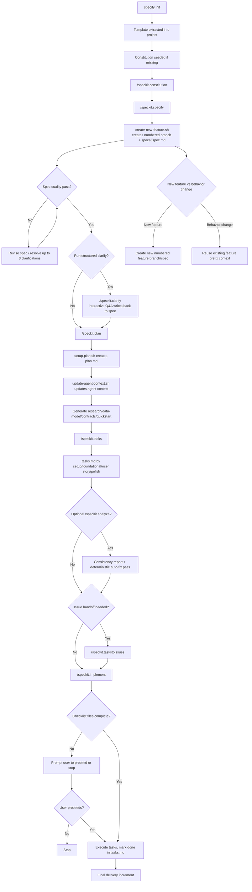

# Spec-Kit Workflow Map

This flow is derived from upstream `spec-kit` scripts/templates and describes the
command progression from project initiation through delivery.

## Notes

- Upstream explicitly enforces a numbered feature branch/spec creation path.
- Behavior changes are supported operationally by reusing existing prefix
  context, but this is policy-driven and not a separate hard-coded command path.
- This repository's skill runs an "upstream-plus" flow: it follows the same
  script progression and adds deterministic analyze-and-fix behavior to reduce
  manual cleanup before issue handoff.
